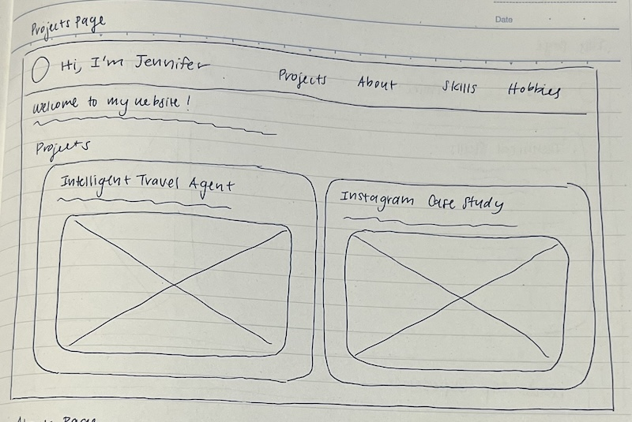
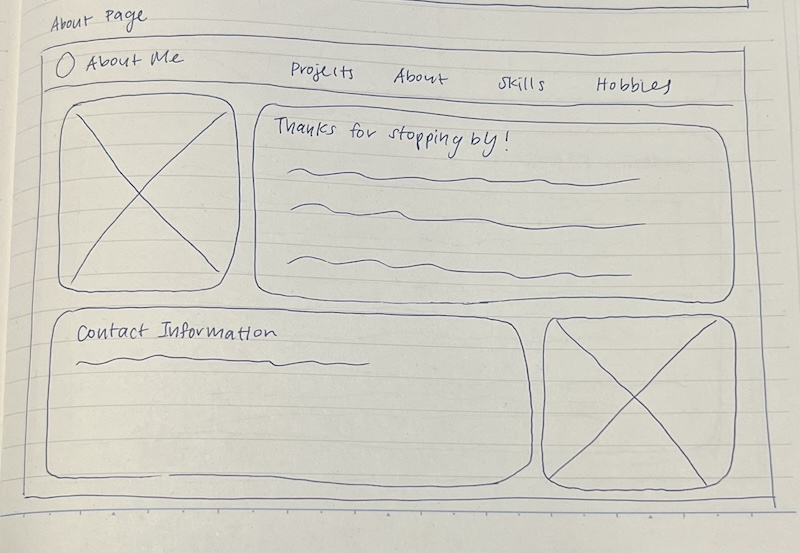
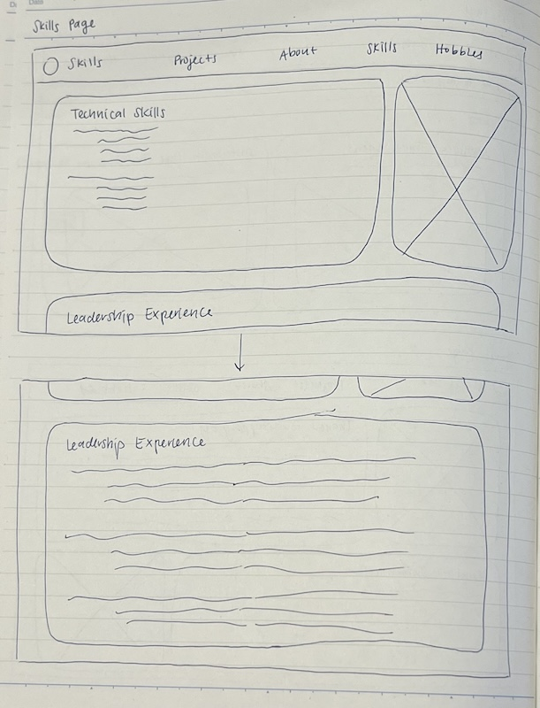
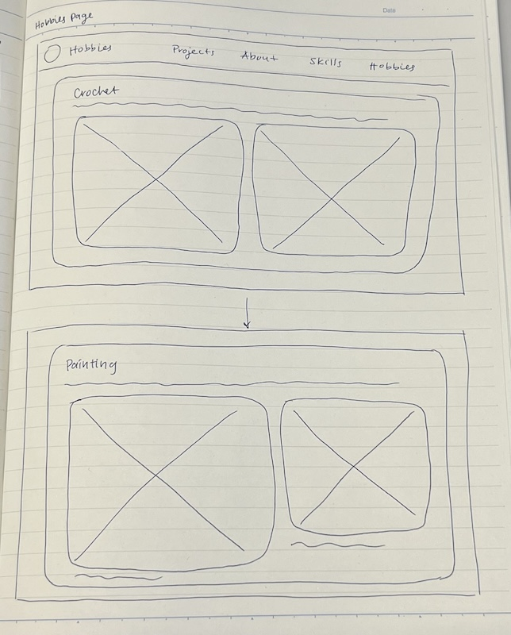

# Project 1, Milestone 1: Design Journey

[← Table of Contents](design-journey.md)

**Replace ALL _TODOs_ with your work.** (There should be no TODOs in the final submission.)

Be clear and concise in your writing. Bullets points are encouraged.

Place all design journey images inside the "design-plan" folder and then link them in Markdown so that they are visible in Markdown Preview.

**Everything, including images, must be visible in _Markdown: Open Preview_.** If it's not visible in the Markdown preview, then we can't grade it. We also can't give you partial credit either. **Please make sure your design journey should is easy to read for the grader;** in Markdown preview the question _and_ answer should have a blank line between them.

## Existing Design

**Make the case for your decisions using concepts from class, as well as other design principles, theories, examples, and cases from outside of class (includes the design prerequisite for this course).**

You can use bullet points and lists, or full paragraphs, or a combo, whichever is appropriate. The writing should be solid draft quality.

### Existing Site: The Site
> What is your existing site about? Tell us about it. (1 sentence)

My existing site is my personal website and portfolio, which displays my past projects, skills, hobbies, and a biography.

> How and where did you create this site? (1 sentence)

I created the site as project 3 for INFO 1300 in Fall 2023 using HTML, CSS, and JavaScript.

> Is this site designed for desktop, mobile devices or both? (1 sentence)

This site is designed for both desktop and mobile devices.

> Explain why this website is a **static** website. (1 sentence)

This website is a static website because it does not have any changing content, the files have the .html extension, and there is no customization for different users.

### Existing Site: Audience
> Briefly explain your site's audience.
> Be specific and justify why this audience is a **cohesive** group. (1-2 sentences)

My site's audience is potential job recruiters and hiring managers who may be looking for a UX designer for their company. This audience is a cohesive group as they share the common goal of searching for university level talent.

### Existing Site: Audience Goals
> Document your existing site's audience's goals. (These should be informed by user research. Not assumptions or stereotypes.)
> List each goal below. There is no specific number of goals required for this, but you need enough to do the job (Hint: It's more than 1 and probably more than 2).

Goal 1: Learn about my skills as applied to projects and experience

Goal 2: Find a way to reach out and contact me

Goal 3: Briefly get familiar with my background, education, and hobbies

### Existing Site: Design/Sketches
> Sketch each page of your existing site.
> **You may not copy your sketches from a previous assignment.**
> Why can't you copy the sketches? I want to get you thinking about the strengths/weaknesses of your current design.
> Provide a **1 sentence** description _underneath_ each sketch that describes the page.

**Projects Page**

The projects page showcases two of my most recent UX design projects, including the title, image, and description and with a popup modal to view the enlarged image.

**About Page**

The about page includes an image of myself, a brief biography about my major and background, and my contact information through email, LinkedIn, and phone number.

**Skills Page**

The skills page includes a section on my technical skills, including lists of design and programming skills, as well as a section on my leadership experience.

**Hobbies Page**

The hobbies page includes a section on my previous crochet project, including a description and two images of the project, as well as a section on my previous painting projects, including a description of my experience and two images of my paintings.

[← Table of Contents](design-journey.md)
