# Project 1, Milestone 2: Design Journey

[← Table of Contents](design-journey.md)

**Replace ALL _TODOs_ with your work.** (There should be no TODOs in the final submission.)

Be clear and concise in your writing. Bullets points are encouraged.

Place all design journey images inside the "design-plan" folder and then link them in Markdown so that they are visible in Markdown Preview.

**Everything, including images, must be visible in _Markdown: Open Preview_.** If it's not visible in the Markdown preview, then we can't grade it. We also can't give you partial credit either. **Please make sure your design journey should is easy to read for the grader;** in Markdown preview the question _and_ answer should have a blank line between them.

## Milestone 1 Feedback Revisions
> Explain what you revised in response to the Milestone 1 feedback (1-3 sentences)

The feedback I received for Milestone 1 included no action items for changes or revision, thus no revisions were made.

## Refined Design

### Refined Design: Persona
> Use the goals you identified and your prior user research to develop a persona of your site's audience.
> Your persona must have a name and a face. The face can be a photo of a face or a drawing, etc.
> You may type out the persona below with bullet points or include an image of the persona. Just make sure it's easy to read the persona when previewing markdown.

Persona's Name: Dave

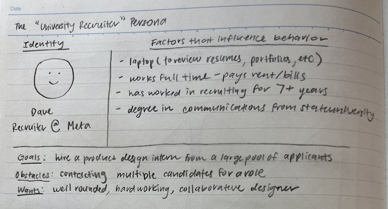

Since my project is created based on my Fall 2023 INFO 1300 Project 3 assignment, and my Project 3 was based on Project 1 (personal website), we were not instructed to conduct user research through user interviews at that point in the class. Thus, my persona's identity is based on my experience through my recent internship recruitment process.

### Refined Design: Narrow or Wide
> Will your refined design be functional on narrow or wide device? (a few words)

My refined design will be functional on a wide device, as Dave will access my portfolio from his laptop.

### Refined Design: Form Brainstorm
> Brainstorm ideas for collecting data from your persona on your website.
> The form must support the persona's goals when using the website.
> For each form idea, explain how the form supports the goals of the persona. (1 sentence per idea)
> **Refer to the persona by name.**

1. Name and email text boxes

    Dave might want to leave behind his name and contact information so that I may reach out to him through email, supporting his goals of getting into contact with me.

2. Name and email text boxes plus notes text field for greetings

    Dave may also want to leave a message for me to let me know that he will contact me or vis versa, supporting his goals of getting into contact with me and communicating his greetings.

3. Name and email text boxes and text field for what project Dave found interesting

    Dave may want to address a project of mine that he found interesting to support his goals or searching for young talent that aligns with a particular available internship space.

4. Name and email text boxes and text field for comments/questions Dave has

    Dave may also want to leave additional comments or questions in the text field regarding my portfolio, as it will support his goals to obtain the best possible vision of me as a candidate for an internship.

### Refined Design: Content
> List **all** the content you plan to include your website for your **persona**.
> You should list all types of content you planned to include (i.e. text, photos, images, etc.)
> List the content here. Label the content as "(new)" if it's new to the existing site.
> **Do not include the content here, just provide a list summarizing the content.**

- my intelligent travel agent design project, including a brief description and image
- my instagram case study design project, including a brief description and image
- my happiness app design project, including a brief description and image (new)
- a photo of myself
- a brief bio about me, what I study, and what I am interested in (contents updated with my current information)
- my contact information, including email, LinkedIn, and phone number
- a form to contact me directly (new)
- a list of my technical skills, including design and programming skills
- a list of my achievements and awards (new)
- descriptions of my leadership experience on campus
- a description and a few images of my crochet hobby
- a description and a few images of my painting hobby

### Refined Design: Content Justification
> Explain why this content supports the goals of your persona. (1-2 sentences)
> **Refer to the persona by name.**

This content supports Dave's goals as they provide the best possible overview of my technical and non-technical abilities as applied to my most recent projects and leadership activities. Dave will also gain an understanding of my interests outside of pursuing my career and education.

### Refined Design: Content Organization
> Organize the content for the audience and identify possible pages for the content using **several iterations** of card sorting.
> Include photographic evidence of each iteration of card sorting **and** an explanation of your thought process for each iteration. (1 sentence per iteration)
> **Please physically sort cards;** please don't try and do this digitally.
> **Refer to the persona by name.**

**Card Sort 1**

I divided my content into hobbies, contact, projects, and about to clearly separate Dave's goals into distinct categories.

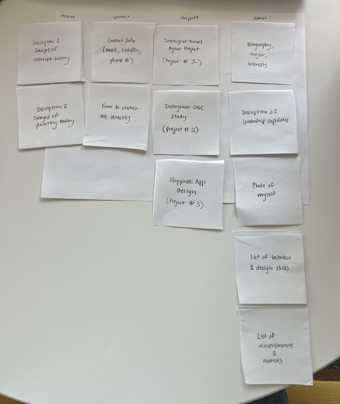

**Card Sort 2**

I divided my content into projects, about, skills, and contact where about includes my hobbies since Dave may desire to view consolidated information about my personal life along with the section about me.

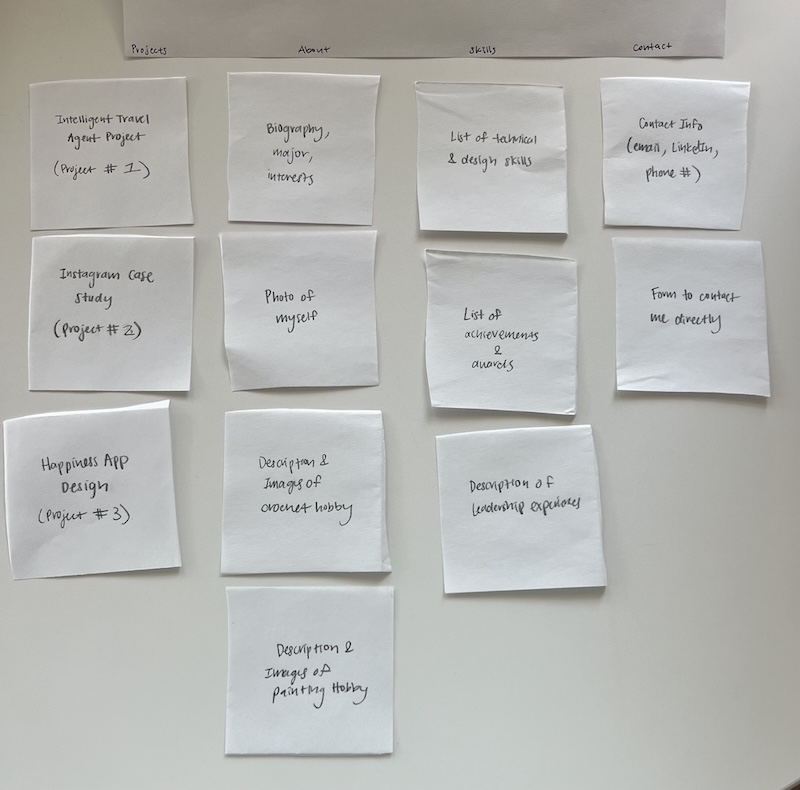

**Card Sort 3**

I divided my content into projects, about, and resume to further simplify the pages that Dave will need to look through when viewing my portfolio and evaluating my candidacy.

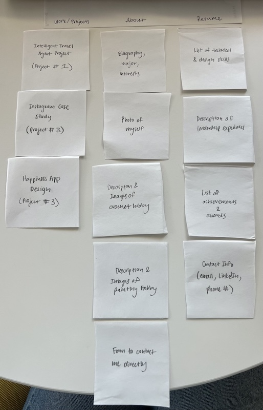

### Refined Design: Navigation
> Please list the pages you will include in your website's navigation.

- Projects
- About
- Skills
- Contact

> Explain why the names of these pages make sense for your persona. (1 sentence)

Dave will immediately be guided by the names of the pages to view the key qualities of myself and my portfolio, through the most important pages of understanding my abilities and being able to reach out.

### Refined Design: Design
> Refine the design of your site to address the goals of your persona.
> Include iterations of **sketches** for each page of the refined design.
> Provide a brief explanation _underneath_ each sketch. (1 sentence per sketch)
> **Refer to your persona by name in each explanation.**

**Projects Page**

**Iteration 1**

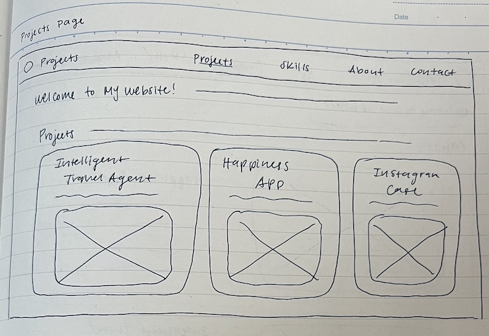

This refined design iteration follows the original design by squeezing in an additional project to show Dave how I have progressed as a designer.

**Iteration 2**

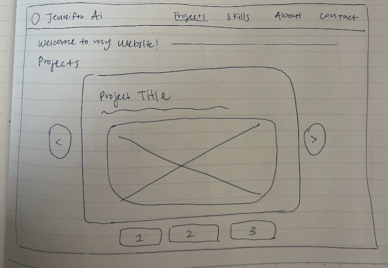

Unlike the first iteration of the design, this design allows for more space for Dave for each project by presenting them through a carousel.

**Iteration 3**

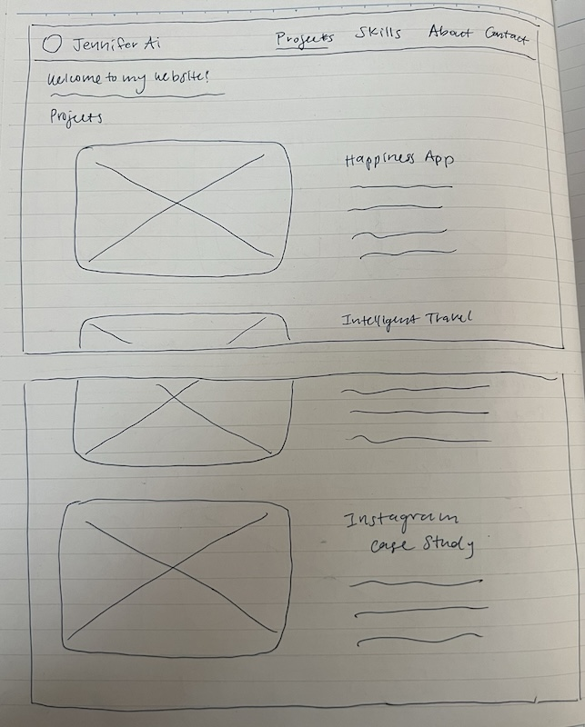

For my third iteration, Dave will have the best possible user experience as his goals will be addressed through viewing each project one by one with sufficient imagery and detail.

**Final Iteration**

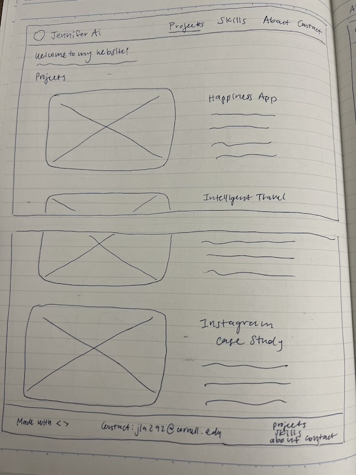

For my final iteration, I modified iteration 3 to include a footer to better serve Dave's needs of accessing my contact information and the navigation when he scrolls down the page.

**About Page**

**Iteration 1**

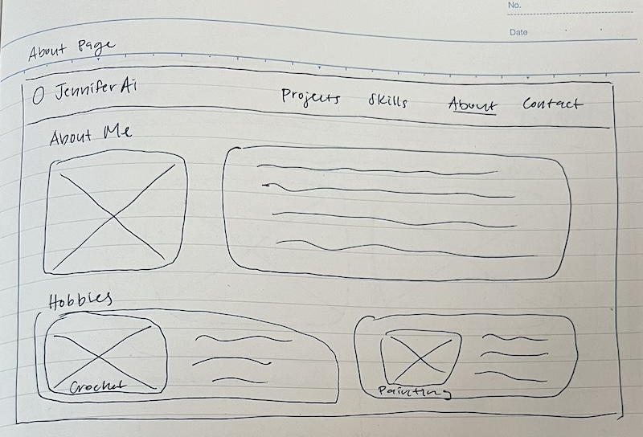

This iteration combines the hobbies page and the about page from the previous website to maximalize the amount of content for Dave to view about myself and my personality.

**Iteration 2**

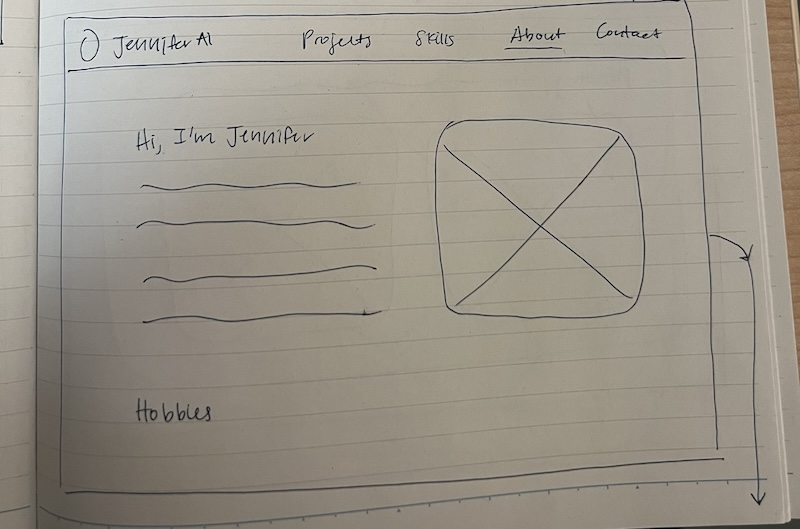
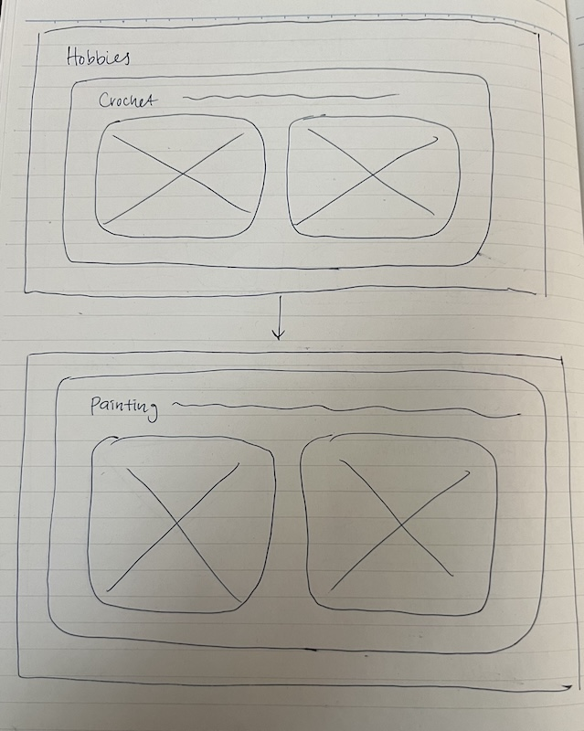

This iteration allows Dave to view my personality and hobbies with more visual space between each idea.

**Iteration 3**

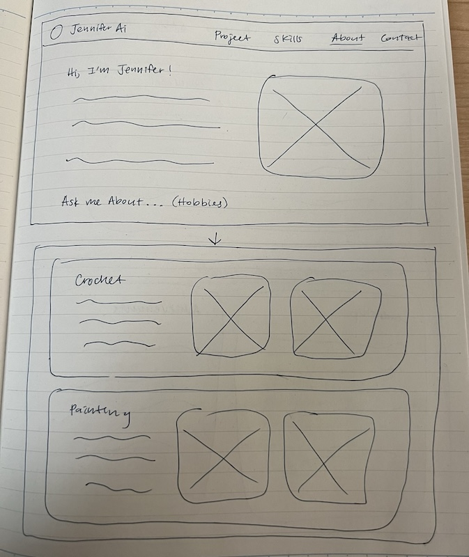

This third iteration is a combination of the previous two as it will allow Dave to learn about me in more of a hierarchal and condensed way.

**Final Iteration**

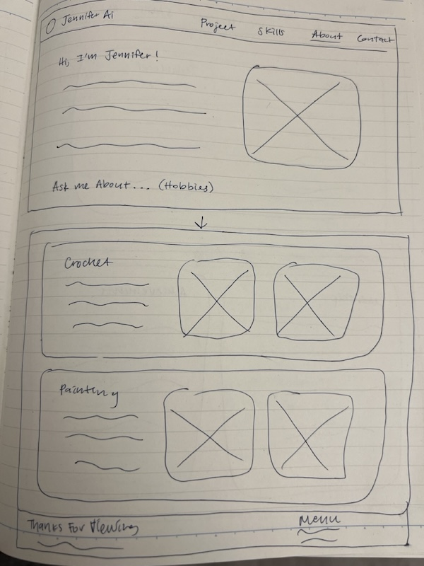

For my final iteration, I modified iteration 3 to include a footer while maintaining the look of the website to better serve Dave's needs of accessing my contact information and the navigation when he scrolls down the page.

**Skills Page**

**Iteration 1**

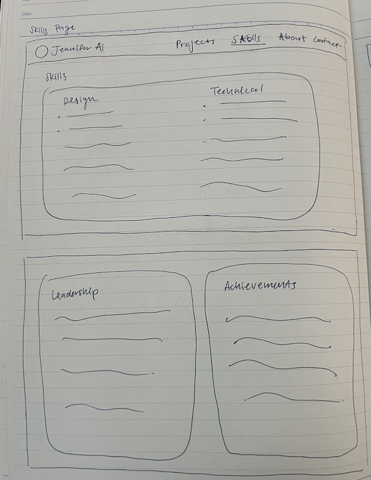

This iteration adds the new content of my achievements for Dave to gain a better view of my abilities and skills.

**Iteration 2**

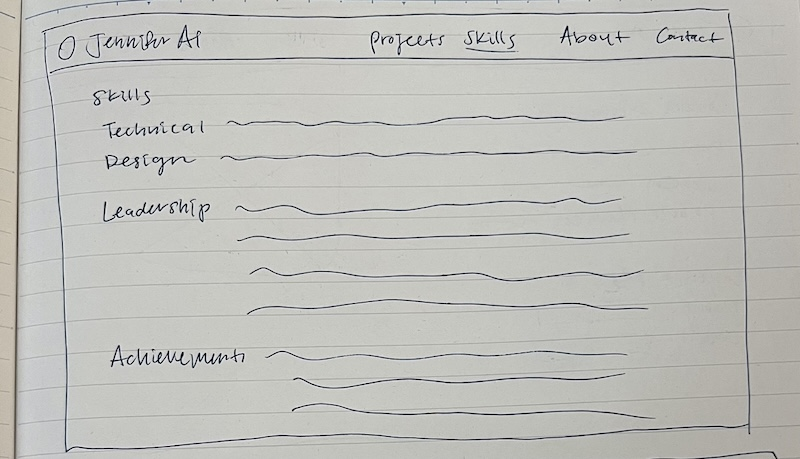

This iteration consolidates content for Dave to view each of my most important skills as applied to various contexts.

**Iteration 3**

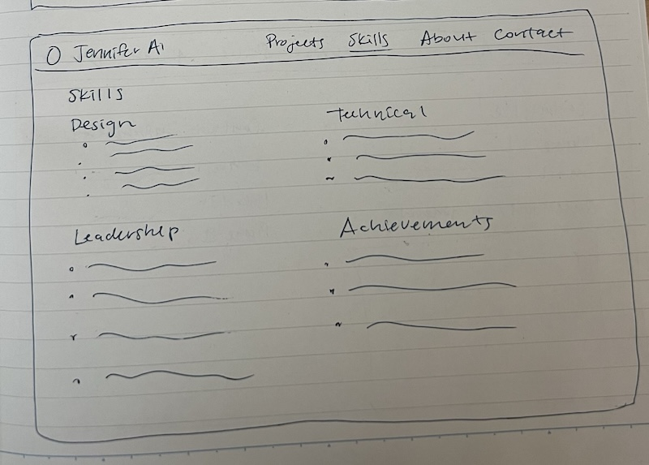

This final iteration allows for another option of consolidated content for Dave to view the highlights of my skills.

**Final Iteration**

For my final iteration, I modified iteration 3 to include a footer and follow the original theme of the website to better serve Dave's needs of accessing my contact information and the navigation when he scrolls down the page.

**Contact Page**

**Iteration 1**

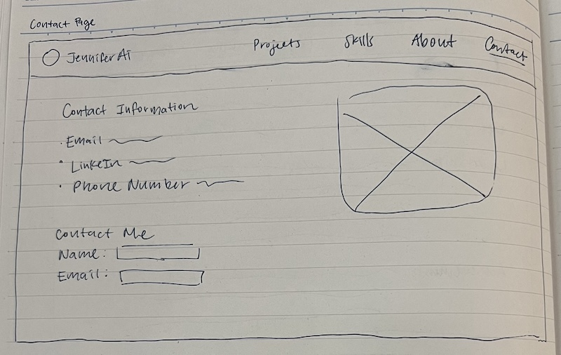

This iteration will let Dave access both my contact information and a form to submit his own information for me to reach out to him.

**Iteration 2**

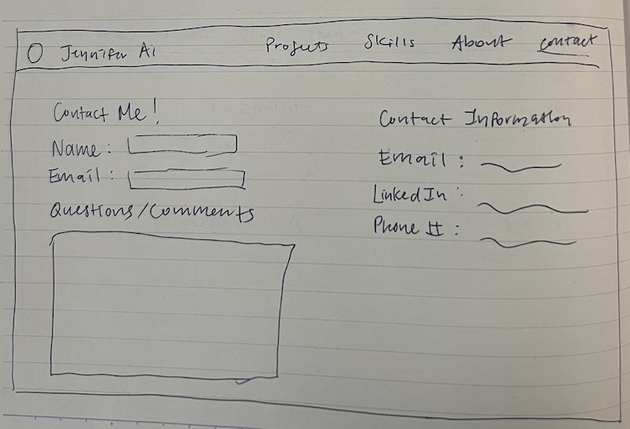

This iteration places the actionable item of a contact form and commentary box side by side with my contact information to allow Dave to consider his options and goals for reaching out to me

**Iteration 3**

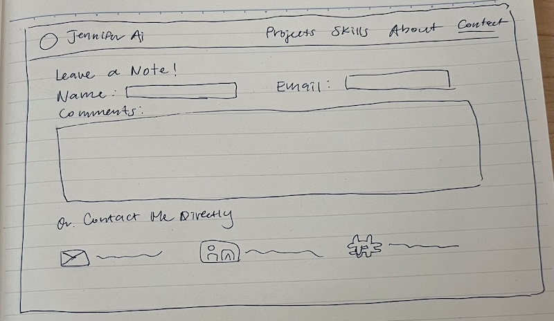

This last iteration encourages Dave to first reach out to me through a form and then look towards contacting me through my personal email and contact information.

**REVISION: Sketches Iterations of Footer**

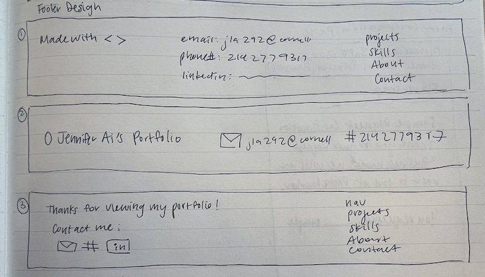

The first iteration of my footer design includes how I created the website, my contact information, and a mini navigation to allow Dave to easily access the most important information from my website. The second iteration includes less information compared to the first iteration to allow Dave to view specific key aspects of my contact information. The third iteration combines a condensed idea from the first two iterations to allow for all forms of contact information as well as another mini version of my website's navigation for Dave's easy access.

### Partial Plan
> Using your refined sketches, plan your site's partials.
> You may describe each partial or sketch it. It's up to you!
> Explain how you will customize at least 1 partial. (1 sentence)

**Partial #1: Header**

The header partial will contain the navigation menu as it remains the same on each page. I will customize this partial by changing the title of each page accordingly through using the echo element.

**Partial #2: Meta**

The meta partial will contain the information in the head html tags of each page, as it remains the same for every page.

**REVISION: Partial #3: Footer**

The footer partial will contain the information in the footer tags of each page and remain the same for each page, which includes a condensed navigation as well as my contact information.

[← Table of Contents](design-journey.md)
