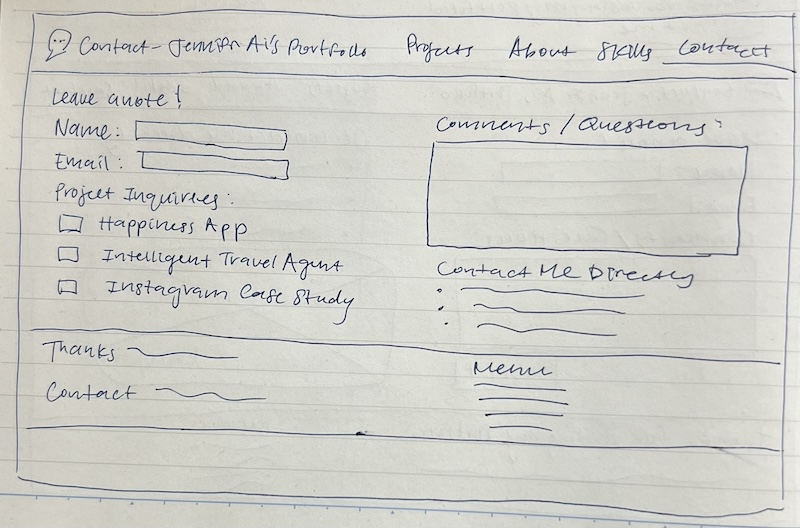
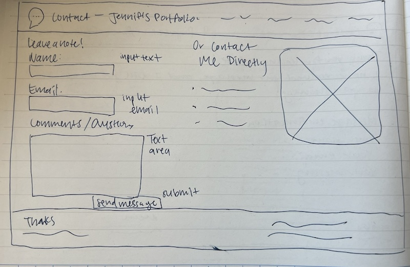
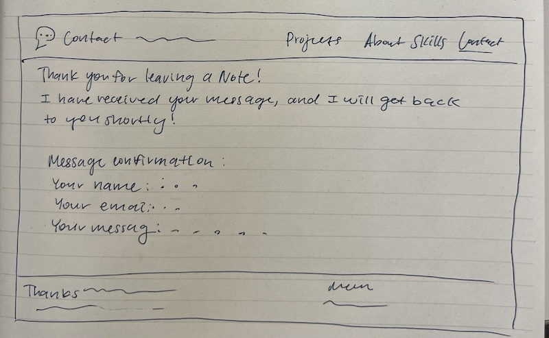

# Project 1, Milestone 3: Design Journey

[← Table of Contents](design-journey.md)

**Replace ALL _TODOs_ with your work.** (There should be no TODOs in the final submission.)

Be clear and concise in your writing. Bullets points are encouraged.

Place all design journey images inside the "design-plan" folder and then link them in Markdown so that they are visible in Markdown Preview.

**Everything, including images, must be visible in _Markdown: Open Preview_.** If it's not visible in the Markdown preview, then we can't grade it. We also can't give you partial credit either. **Please make sure your design journey should is easy to read for the grader;** in Markdown preview the question _and_ answer should have a blank line between them.

## Milestone 2 Feedback Revisions
> Explain what you revised in response to the Milestone 2 feedback (1-3 sentences)
> If you didn't make any revisions, explain why.

Since my Milestone 2 feedback stated having two partials right next to each other only counts as one partial, I revised my Milestone 2 design journey to include a second partial that is distinctly separate from the first one. This partial is conceptualized from the newly designed footer of my website. I first sketched iterations of the footer design (located in the refined design section of milestone 2), which remains the same for each page, before implementing the footer in code with partials.

## Form Design and Planning

### Form Purpose & Persona Goals
> Explain your form's purpose and how it supports the goals of your persona. (1-2 sentences)

My form's purpose is to allow Dave to contact me directly after viewing my entire website portfolio. This supports Dave's goal of reaching out and connecting with a potential university intern.

### Form Design
> Design your site's form.
> Include iterations of **sketches** of the form.
> Provide a brief explanation _underneath_ each sketch. (1 sentences for each sketch)

**Iteration 1**

My first iteration places the name and email inputs inline and allows a comments/questions text area for Dave's messages.

**Iteration 2**

My second iteration adds an additional form input function of checkboxes to allow Dave to specify which projects of mine he wants to comment or ask questions on.

**Iteration 3**

My third iteration places the name and email inputs above each respective input box and simplifies the idea from the previous iteration to allow Dave more freedom and flexibility over his commentary.

**Iteration 4: Final Sketch**

My fourth and final iteration places the form next to both my contact information and the decorative image in one row to allow Dave to view all important pieces of information in one place.

### Form Confirmation
> Design your site's form confirmation page.
> Include iterations of **sketches** of the form.
> Provide a brief explanation _underneath_ each sketch. (1 sentences for each sketch)

**Iteration 1**

In my first iteration I integrated the form's information within a singular sentence as a confirmation so that it appears more conversational to Dave.

**Iteration 2: Final Sketch**

In my second and final iteration I decided to separate the details of ther form's information to make clear to Dave which particular pieces of information were collected.

### Form Planning
> Will your form use a GET or POST request?
> Justify your decision as to why the request type is appropriate for the form. (1 sentence)

My form will use a POST request, as it will be collecting private information of Dave's email.

[← Table of Contents](design-journey.md)
