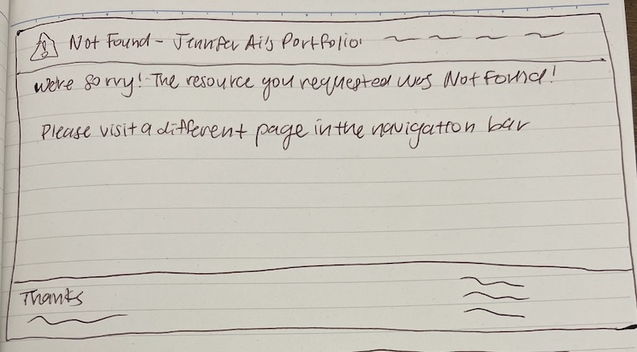
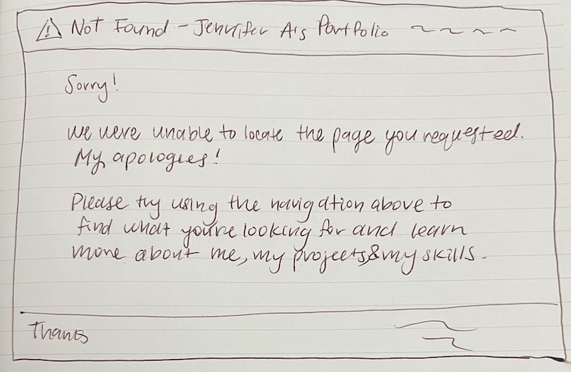

# Project 1, Final Submission: Design Journey

[← Table of Contents](design-journey.md)

**Replace ALL _TODOs_ with your work.** (There should be no TODOs in the final submission.)

Be clear and concise in your writing. Bullets points are encouraged.

Place all design journey images inside the "design-plan" folder and then link them in Markdown so that they are visible in Markdown Preview.

**Everything, including images, must be visible in _Markdown: Open Preview_.** If it's not visible in the Markdown preview, then we can't grade it. We also can't give you partial credit either. **Please make sure your design journey should is easy to read for the grader;** in Markdown preview the question _and_ answer should have a blank line between them.

## Milestone 3 Feedback Revisions
> Explain what you revised in response to the Milestone 3 feedback (1-3 sentences)
> If you didn't make any revisions, explain why.

I did not recieve any feedback for Milestone 3. However, I recieved feedback from a TA in office hours to include my footer on each design of my final design iterations in Milestone 2, so I revised Milestone 2 designs to reflect the design of the footer for my pages.

## URL Design
> Plan your HTTP routing.
> List each route and the PHP file for each route.

| Route                    | PHP File                            |
| ------------------------ | ------------------------------------|
| /                        | pages/index.php                     |
| /about                   | pages/about.php                     |
| /skills                  | pages/skills.php                    |
| /contact                 | pages/contact.php                   |
| /contact/confirmation    | pages/contact-confirmation.php      |

> Explain why these routes (URLs) are usable for your persona. (1 sentence)

These routes are usable for Dave because they provide straightforward and easy to remember URLs for him.

## Missing Resource / Not Found Page
> Refine the design of your site's missing resource 404 page for your persona.
> Include iterations of **sketches** of the page.
> Provide a brief explanation _underneath_ each sketch. (1 sentence)
> **Refer to the persona by name.**

**Iteration #1**

My first iteration of the missing resource includes the required information of notifying Dave of the issue and a prompt for how to leave the page.

**Iteration #2**

My second iteration of the missing resource page includes additional information regarding the pages of my website to notify Dave in further detail about which specific pages he may be looking for.

## Self-Reflection
> Take some time here to reflect on how much you've learned since you started this class. It's often easy to ignore our own progress. Take a moment and think about your accomplishments in this class. Hopefully you'll recognize that you've accomplished a lot and that you should be very proud of those accomplishments! (2-4 sentences)

I have learned a lot about backend programming and server side rendering techniques through PHP. I have accomplished creating a persona for my site as well as developing and designing a form to address my persona's needs. I feel confident in my abilities to continue developing dynamic websites.

## Grading

### Grading: Mobile or Desktop
> When we grade your final site, should we grade this with a narrow or wide screen?

Wide Screen

### Collaborators
> List any persons you collaborated with on this project.

N/A

### Reference Resources
> Please cite any external resources you referenced in the creation of your project.
> (i.e. W3Schools, StackOverflow, Mozilla, etc.)

N/A

[← Table of Contents](design-journey.md)
